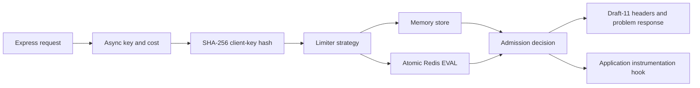

# Architecture

The limiter owns validation, key hashing, failure policy, and decision semantics. Stores own only atomic state transitions. The Express adapter resolves request-specific keys and costs, serializes headers, and maps denials to problem responses.

## Sliding window

Memory mode retains weighted timestamp entries. Redis mode stores one sorted-set member per quota unit and evaluates expiry, current usage, admission, insertion, remaining quota, and TTL inside one Lua script. This makes weighted admission exact but means very large costs are intentionally rejected by configuration or should use a coarser application quota unit.

## Token bucket

Both stores implement discrete refills. Redis uses server time to avoid application-host clock skew. Hash fields hold remaining tokens and the last refill boundary, with an expiry long enough to refill an idle bucket fully.

## Package boundary

The root export has no runtime Redis dependency. `@meherwer_ali/throttle/redis` accepts the small `RedisClientLike` structural interface implemented by node-redis 6. Express remains a peer dependency so the host owns its framework version.
